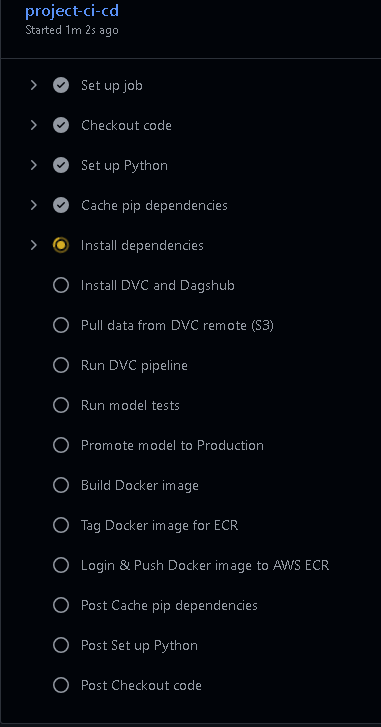
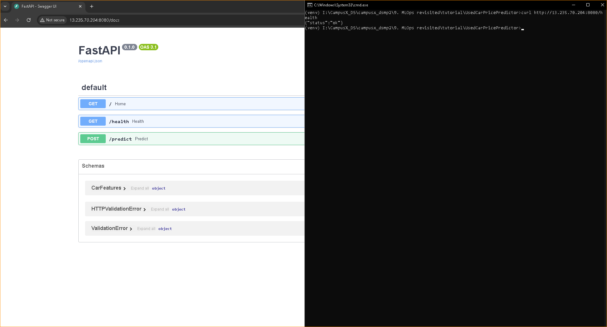

**Project Setup**

    1. Create github repo using ml template

    2. clone on local pc (clean based on current project)

    3. create venv -- install requirements_dev.txt

    4. host mlflow on dagshub

        --------------------------------------------------------------------------------------------
        https://github.com/iamprashantjain/UsedCarPricePredictor.git

        import dagshub
        dagshub.init(repo_owner='iamprashantjain', repo_name='UsedCarPricePredictor', mlflow=True)
        --------------------------------------------------------------------------------------------

    5. run pip install -e . -- To install project as package

    6. Setup S3, ECR, Launch Template, ASG, CodeDeploy etc

**ML Experiments**

- While Tracking Experiments on MLFlow -- Track each experiment under seperate experiment run
- So there will be 4 experiments on mlflow dashboard for:
        + baseline
        + best model & transformation
        + best hyper params
        + dvc runs

    6. test mlflow if connected

    7. run 3 experiments
        1. baseline: To identify how much accuracy i'm able to get without doing any thing
        2. best algorithm & transformation/imputing technique: run multiple alrotihms & transformation techniques -- we will get which model & transformation technique is performing best.
        3. fine tuning best model
        4. track all experiments on mlflow for evaluation later

**Create DVC Pipeline of best model & params**

8. dvc init
9. add dvc remote (local or s3) - (echo %TEMP%) or s3 -- dvc remote add -d s3_remote s3://prashant-mlops-bucket
10. create src/components for 
        - data ingestion: fetch data from cloud & save model as raw, train & test
        - transformation: transform data and crate preprocessor.pkl
        - model trainer: train model using best model hyper params & create model.pkl
        - model evaluation: compare metrics from previous model and add flag whether its good or not
        - register_model: register model to staging if flag is true else not
        
        + add above components only in dvc pipeline
        + perfoem testing and promote model during CI

        - test_model: perform tests & comparisons
        - promote_model: promote model from staging to production

11. crate dvc pipeline (dvc.yaml + params.yaml)
12. dvc repro (for error: ModuleNotFoundError: No module named 'src' --- pip install -e .)
13. send best model to model_registry
14. update .gitignore file with venv/, artifacts/ 
15. git add ., git commit, dvc push (push everything which is being tracked by dvc to s3), dvc push, git push

**Add CI**

16. create .github/workflows/ci.yaml
    - set secrets in github repo
        1. AWS_ACCESS_KEY_ID
        2. AWS_SECRET_ACCESS_KEY
        3. DAGSHUB_PAT
        4. AWS_REGION (ap-south-1)

    **CI code should be like this:**
    
    - Checkout code – Pulls your repo code into the runner.
    - Set up Python – Installs Python 3.10 on the GitHub runner.
    - Cache pip dependencies – Speeds up builds by caching Python packages.
    - Install dependencies – Installs all required Python packages for dev.
    - Install DVC and Dagshub – Installs DVC (with S3 support) and Dagshub CLI.
    - Pull data from DVC remote – Downloads data from remote storage (S3).
    - Run DVC pipeline – Executes the DVC pipeline (dvc repro) to run ML stages.
    - Run model tests – Runs unit tests to validate the model behavior.
    - Promote model to Production – Registers or promotes the model based on evaluation.
    - Build Docker image – Builds a Docker image named prashant-mlops-ecr.
    - Tag Docker image for ECR – Tags the Docker image for your AWS ECR repo.
    - Login & Push Docker image to AWS ECR – Authenticates and pushes the image to AWS ECR.
    
    - ***Perform model testing and promotion outside of DVC, In GitHub Actions bcoz DVC is a great tool for tracking data and managing deterministic pipelines***
    - ***But model promotion and testing involve business logic, model governance, and external system interaction***

    - check if docker image is stored in ECR or not.

**Model Serving**

- ***RECAP***

    1. fecth data from dbs
    2. performed data assesment, cleaning, eda
    3. performed 3 experiments:
        - baseline model
        - best algorithm and transformation technique
        - hyper parameter tuning
    4. created dvc pipeline with best model and hyper parameters
        - data ingestion
        - data transformation
        - model trainer
        - model evalution
        - register model
    5. Add CI which will pull data from s3, run dvc pipeline, perform model testing & promote model if success

17. write test code to fetch model from model_registry
18. create fastAPI/flaskAPI code which will fetch model from model registry to make predictions -- test locally

**Dockerize FastAPI**

19. Create dockerfile
    - make minimalistic image which will only have requirements & dependencies to run api -- no need to dockerize complete project folder
20. Create docker image of the app using Dockerfile
21. Test run it on local system, If runs successfully then add it to CI/CD pipeline

    - FOR /F "tokens=*" %i IN ('docker ps -aq') DO docker rm -f %i & FOR /F "tokens=*" %i IN ('docker images -aq') DO docker rmi -f %i & FOR /F "tokens=*" %i IN ('docker volume ls -q') DO docker volume rm %i & docker system prune -a --volumes --force
    - docker build -t used-car-price-container . && docker run -it -p 8000:8000 --rm --name used-car-container -e DAGSHUB_PAT=7bed6b5be2021b1a4eaae221787bcb048ab2bcfd used-car-price-container

22. Add Creating Docker image and push image to Docker in CI
    - login ecr, build image, tag & push (as per show push commands)

**Add CD -- Continous Deployment**

23. There are 2 approaches to Deploy the Docker image on EC2:
    1. Direct Deployment on EC2 Instance (Single Instance):
        - Manually set up and run the Docker container directly on the EC2 instance.
        
        - **Issues & Solution**
        - Everything is manual -- We will automate
        - No option of scaling -- Add auto sacling group
        - Reproducibility (manually scaling up & down) -- launch Template
        - Version Updates & Roll backs V1 to V2 or V2 to V1 -- BlueGreen deployment        
        - We will use **CodeDeploy** to handle all these challenges

    2. Deployment on EC2 Using ASG & AWS CodeDeploy (Multi Instance):
        - Automate the deployment process by integrating with AWS CodeDeploy, which manages the rollout of Docker containers on EC2.
        
        1. We will first deploy the current App
        2. Modify a method or ML model logic to simulate a version change (e.g., V1 → V2).
        3. Redeploy the updated version using CodeDeploy.
        4. Test rollback from V2 → V1 using CodeDeploy’s Blue/Green deployment capabilities.

        - **Benefits**
            - blue/green deployment strategy: zero downtime
            - automated rollbacks if new deployment fails
            - granular control like how many instances, health checks, pre & post deployment scripts etc
            - seamless integration with ci/cd pipelines

24. **Workflow to Deploy App using Codedeploy + BlueGreen Deployment Strategy**
    
    0. Create new IAM roles
        1. ECR, S3 and CodeDeploy for ASG
        2. CodeDeploy for codedeploy service

    1. Create Launch Template (Its used for reproducibility & install code deploy agent)
        
        ------------------------------------------------------------------------------------------------------------------
        #!/bin/bash

        # Update the package list
        sudo apt-get update -y

        # Install Ruby (required by the CodeDeploy agent)
        sudo apt-get install ruby -y

        # Download the CodeDeploy agent installer from the correct region
        wget https://aws-codedeploy-ap-southeast-2.s3.ap-southeast-2.amazonaws.com/latest/install

        # Make the installer executable
        chmod +x ./install

        # Install the CodeDeploy agent
        sudo ./install auto

        # Start the CodeDeploy agent
        sudo service codedeploy-agent start

        ------------------------------------------------------------------------------------------------------------------

    2. Create ASG using above launch template, Attach Loadbalancer to it -- sudo service codedeploy-agent status
    3. Create CodeDeploy application -- "UsedCarPricePredictorV1"
    4. Create deployment group (attach asg with codedeploy using deployment group) -- "CodeDeployServiceRole"
    5. Create appspec.yml & create a folder deploy/scripts and add 2 files:
        - install_dependencies.sh
        - start_docker.sh
    6. once we push changes to git, It will trigger ci/cd and app will be deployed and ready to serve

**In Summary**

- Scrape Data or fetch data from Dbs (In our case we have scraped data from cars24 website)
- Perform:
    1. Data Assesment
    2. Data Cleaning
    3. EDA
    4. Feature Engineering (if requried)
    5. Data Transformation

- Now that we have data in good quality, we can run multiple experiments with goal of finding best model based on our data & best hyper parameters. We have used MLFlow hosted on dagshub to track experiments and log details.
- Run 3 experiments:
    1. baseline
    2. best model
    3. best hyperparameters
- Once we have model & hyper parameters, we will create a DVC pipeline for reproducibility.
- Add CI: To run dvc pipeline on every code push
- Perform testing of model & once success then push model to Model Registry
- Create a FastApi to fetch model from model registry & test predictions etc
- On success, Dockerize fastapi app and push image to AWS ECR
- Now, In order to deploy that docker app we have 2 options:
    1. Simple (for testing projects) --> Deploy image directly on EC2
    2. Industry based --> Deploy on EC2 through ECS where we will get benefit of Load balancer & Monitoring etc

**Challenges & Solutions**

1. src folder not found: use pythonpath or pip install -e .
2. dagshub not loading model from model registry: build docker image with model & push to ecr
3. dependencies issues on CI or when creating docker image: remove pytz (mostly works) or keep removing versions just keep the name
4. always add host in api file to 0.0.0.0 so that it will remain accessible bcoz it will be running inside docker
5. setup everything before strating to save time like github repo, dvc remote, dagshub + mlflow, ecr, launch template, asg, deployment group, github secrets etc
6. always dvc push before git push so that all artifacts are present in s3 which will be pulled during ci
7. file paths gives trouble bcoz docker will be on linux & project is developed on windows
8. aws property names should match exactly: s3 bucket, group name, app name, docker image/container name etc.
9. mlflow model registry unable to load best_model.yaml bcoz thats not the correct file -- It will not be able to parse this file, instead save it to .pkl in model_evaluation stage
10. In V2 of the model we can do following changes, Currently accuracy is 85% but RSMSE is approx 2lakh+, If prices vary from 50k to 2500k then RMSE will naturally be large. (apply log transformation in price)
    - y_train_log = np.log1p(y_train)
    - model.fit(X_train, y_train_log)
    - preds = np.expm1(model.predict(X_test))
11. Keep same folder structure in docker image also to find every file using same code
12. api app should have home route ("/") because aws uses that to validate
13. App needs some time to fully start like downloading model from mlflow etc, but health checks happen immediately thats why target group health check fails -- add wait_for_health.sh & update cicd zip

<!-- 7bed6b5be2021b1a4eaae221787bcb048ab2bcfd     -->